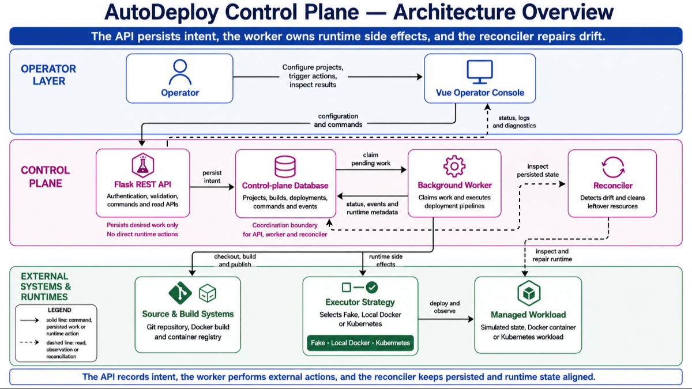
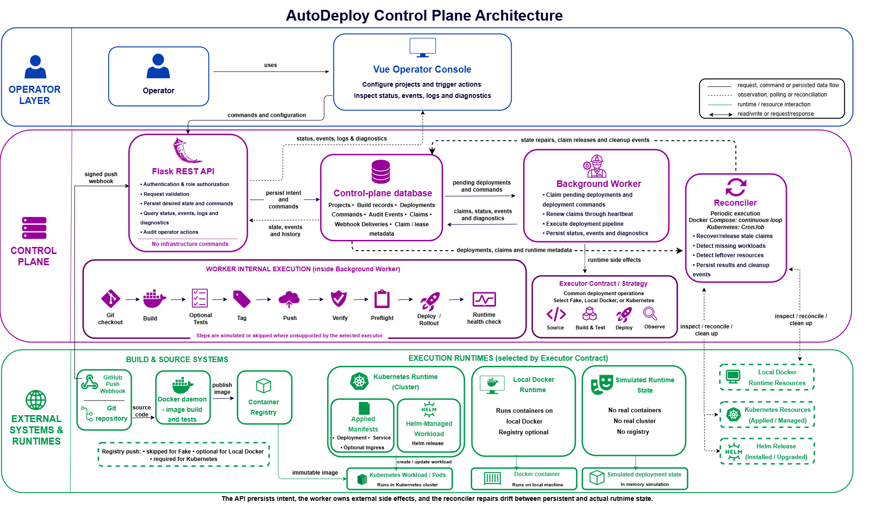
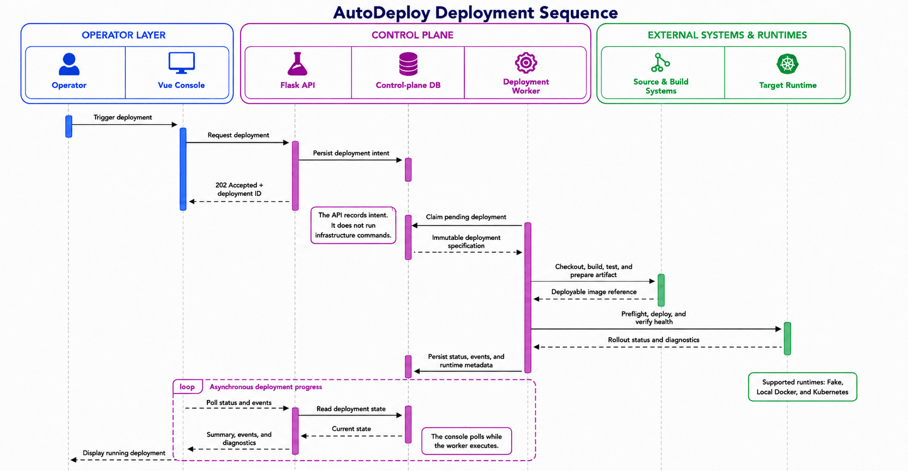
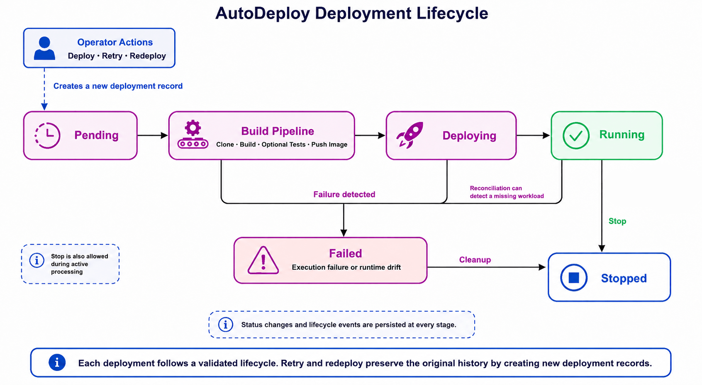
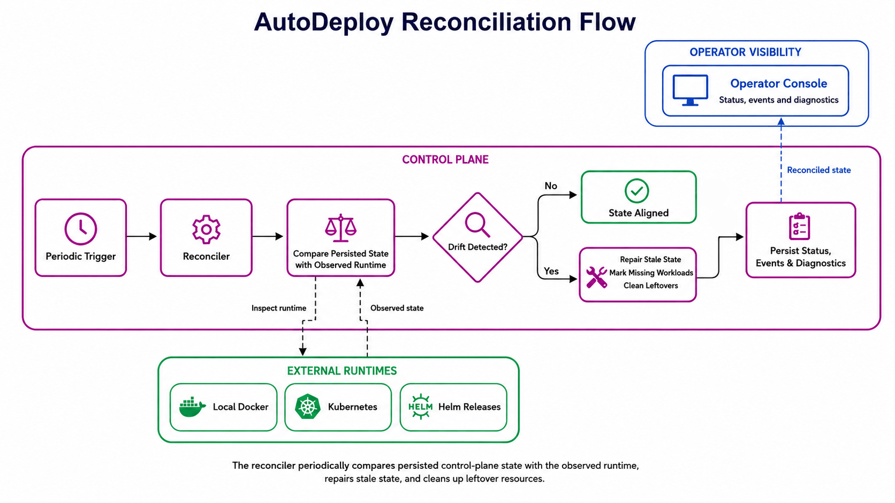
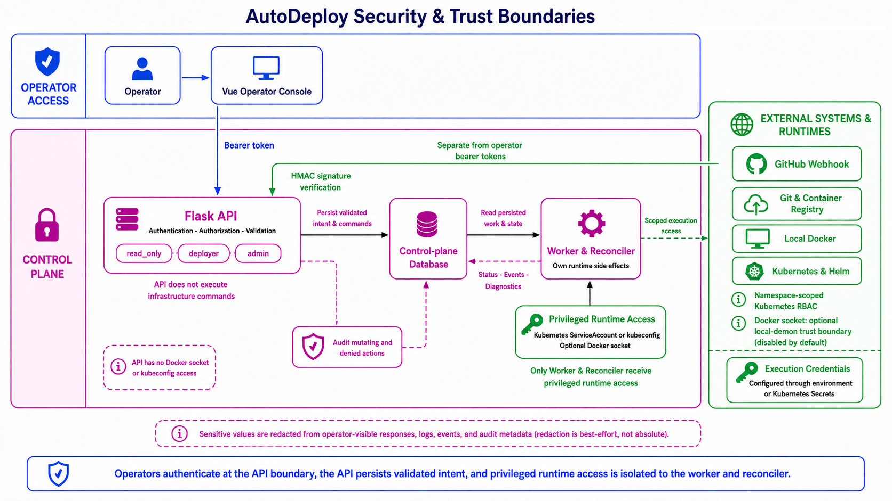
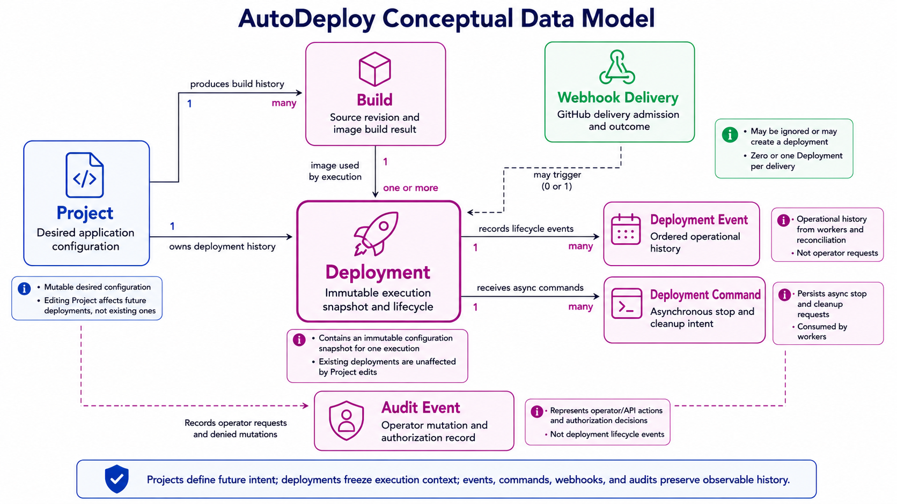

# AutoDeploy Control Plane

[](https://github.com/adelaspc/autodeploy-platform/actions/workflows/ci.yml)

AutoDeploy is an operator-facing PaaS control plane that turns project specifications into observable, asynchronous deployments across simulated, local Docker, and Kubernetes runtimes.

## See it in action

The primary demo follows one deployment from a declarative project specification through source checkout, container build and test, registry push with digest pinning, Helm rollout, health verification, and persisted diagnostics.

[](docs/assets/demo/01-happy-path.mp4)

**[Watch the happy-path deployment with playback controls (MP4, 5.0 MB)](docs/assets/demo/01-happy-path.mp4)**

The [complete demo walkthrough](docs/demo.md) explains the configuration behind the recording and provides focused scenarios for configuration updates, controlled health and startup failures, Kubernetes self-healing, diagnostics, and cleanup.

## What this project demonstrates

- A Flask API that persists desired deployment state instead of running infrastructure commands in HTTP requests.
- A leased background worker with claim heartbeats, ownership checks, retries, and explicit failure reasons.
- Reconciliation of stale claims, missing workloads, and leftover Docker or Kubernetes resources.
- Immutable deployment snapshots, lifecycle validation, and a detailed event stream for every build and rollout step.
- Docker build/test/run and Kubernetes manifest or Helm deployment paths behind one executor contract.
- A Vue operator console for project configuration, deployment actions, logs, health, events, and diagnostics.
- Bearer-token roles, audit records, request correlation, secret redaction, namespace-scoped RBAC, and opt-in Docker socket access.
- CI coverage for Python and frontend tests, lint, migrations, dependency/security checks, container builds, Compose, and Helm templates.

## Architecture at a glance

```mermaid
flowchart LR
    subgraph operator["Operator layer"]
        O[Operator]
        UI[Vue operator console]
        O --> UI
    end

    subgraph control["Control plane"]
        API[Flask REST API]
        DB[(Control-plane database)]
        WORKER[Background worker]
        RECON[Reconciler]

        API -->|persist desired state| DB
        DB -->|claim pending work| WORKER
        WORKER -->|status, events and diagnostics| DB
        RECON -.->|inspect persisted state| DB
    end

    subgraph external["External systems and runtimes"]
        GIT[Git repository]
        BUILD[Docker build and test]
        REG[(Container registry)]
        EXEC{Executor contract}
        FAKE[Fake runtime]
        LOCAL[Local Docker]

        subgraph kubernetes["Kubernetes"]
            MODE{Deployment mode}
            MANIFEST[Generated manifests]
            HELM[Generic Helm chart]
            MODE --> MANIFEST
            MODE --> HELM
        end

        APP[User workload]

        GIT --> BUILD
        BUILD --> REG
        EXEC --> FAKE
        EXEC --> LOCAL
        EXEC --> MODE
        LOCAL --> APP
        MANIFEST --> APP
        HELM --> APP
    end

    UI -->|commands and configuration| API
    API -.->|status, events, logs and diagnostics| UI
    WORKER -->|checkout source| GIT
    WORKER -->|build and test image| BUILD
    WORKER -->|runtime side effects| EXEC
    REG -->|digest-pinned image| MODE
    RECON -.->|detect drift and clean up| EXEC

    classDef operatorNode fill:#e0f2fe,stroke:#0369a1,color:#0c4a6e;
    classDef controlNode fill:#ede9fe,stroke:#6d28d9,color:#3b0764;
    classDef dataNode fill:#fef3c7,stroke:#b45309,color:#78350f;
    classDef runtimeNode fill:#dcfce7,stroke:#15803d,color:#14532d;

    class O,UI operatorNode;
    class API,WORKER,RECON controlNode;
    class DB,REG dataNode;
    class GIT,BUILD,EXEC,FAKE,LOCAL,MODE,MANIFEST,HELM,APP runtimeNode;
```



The API records intent, the worker owns side effects, and the reconciler repairs drift. Deploy, retry, redeploy, stop, and cleanup all cross the same persisted ownership boundary. See [Architecture](docs/architecture.md) for claims, snapshots, execution, reconciliation, and runtime boundaries.

## Visual architecture

The simplified overview is the recommended starting point for recruiters and first-time reviewers. Select it to open the full-resolution version.

[](diagrams/autodeploy-architecture-overview.png)

**[Open the simplified architecture overview](diagrams/autodeploy-architecture-overview.png)**

The detailed architecture and focused views below provide optional technical depth. Select any thumbnail to open the full-resolution version.

| System view | Runtime behavior |
| --- | --- |
| [](diagrams/autodeploy-architecture.png) | [](diagrams/autodeploy-deployment-sequence.png) |
| **[Detailed control-plane architecture](diagrams/autodeploy-architecture.png)** | **[Deployment sequence](diagrams/autodeploy-deployment-sequence.png)** |
| [](diagrams/autodeploy-deployment-lifecycle.png) | [](diagrams/autodeploy-reconciliation-flow.png) |
| **[Deployment lifecycle](diagrams/autodeploy-deployment-lifecycle.png)** | **[Reconciliation flow](diagrams/autodeploy-reconciliation-flow.png)** |
| [](diagrams/autodeploy-security-and-trust-boundaries.png) | [](diagrams/autodeploy-data-model.png) |
| **[Security and trust boundaries](diagrams/autodeploy-security-and-trust-boundaries.png)** | **[Conceptual data model](diagrams/autodeploy-data-model.png)** |

## Five-minute quick start

This path uses SQLite and the `fake` executor. It needs Python 3.12 and Node.js 22, but no Docker daemon, registry, MySQL, or Kubernetes cluster.

```bash
git clone https://github.com/adelaspc/autodeploy-platform.git
cd autodeploy-platform

python3.12 -m venv .venv
.venv/bin/python -m pip install --upgrade pip
.venv/bin/python -m pip install -r requirements-dev.txt

make env-init
make db-upgrade PROFILE=demo

cd frontend
npm ci
cd ..
```

Start the three processes in separate terminals:

```bash
make api PROFILE=demo
```

```bash
make worker PROFILE=demo
```

```bash
cd frontend && npm run dev
```

Open `http://127.0.0.1:5173`. Create a project with these minimum values:

| Field | Value |
| --- | --- |
| Name | `control-plane-demo` |
| Repository | the absolute path to this clone |
| Branch | your current local branch, usually `main` |
| Port | `5000` |
| Healthcheck | `/health` |

Save the project, select **Deploy**, and watch the fake worker move it to `running`. The console shows the deployment summary and persisted events without building or publishing an image. Local paths are accepted only in the development profile; production-style configurations accept canonical GitHub HTTPS URLs.

To exercise the API directly instead, create and deploy a project with:

```bash
ROOT="$(pwd)"
curl -fsS http://127.0.0.1:5000/api/projects \
  -H 'Content-Type: application/json' \
  -d "{\"name\":\"control-plane-demo\",\"repo_url\":\"$ROOT\",\"branch\":\"$(git branch --show-current)\",\"port\":5000,\"healthcheck_path\":\"/health\"}"

curl -fsS -X POST http://127.0.0.1:5000/api/projects/1/deploy \
  -H 'Content-Type: application/json' -d '{}'

curl -fsS http://127.0.0.1:5000/api/projects/1/deployments/latest
curl -fsS http://127.0.0.1:5000/api/projects/1/deployments/1/events
```

The demo profile explicitly disables bearer authentication for local development. Never carry that setting into a production-like environment.

## Execution modes

| Mode | What it proves | Infrastructure |
| --- | --- | --- |
| `fake` | API, persistence, worker claims, lifecycle, events, UI | SQLite only |
| `local-docker` | Clone, image build/test, optional push, container health and logs | Docker; registry optional |
| `kubernetes` | Image publish, manifests or Helm, rollout, diagnostics, ingress and cleanup | Docker, registry, Kubernetes |

Profiles are selected with `PROFILE=demo`, `PROFILE=local-docker`, or `PROFILE=local-kubernetes`. The complete configuration and validated operating procedures live in the [Runbook](docs/runbook.md).

## Common verification commands

```bash
# Fast backend tests and lint
make test
make lint

# Frontend unit/component tests and production build
make frontend-test
make frontend-build

# Container build
docker build --tag autodeploy-control-plane:local .
```

Infrastructure-dependent suites are opt-in: `make integration-docker`, `make integration-mysql`, and `make integration-kubernetes`. See [Development](docs/development.md) for dependency locks, repository layout, all local checks, and the CI job map.

## Security boundaries and non-goals

This is a credible single-operator/platform portfolio system, not a hardened public multi-tenant PaaS. API tokens implement `read_only`, `deployer`, and `admin` roles; Git/registry secrets come from ignored files or Kubernetes Secrets; response and log surfaces redact known secret values; and executable project commands reject shell control syntax.

Docker socket access and kubeconfig access are deliberate trusted-operator boundaries. Socket mounting is disabled in the base Compose and Helm configurations and should never be enabled for untrusted repositories. Namespace-per-tenant isolation, OAuth/user management, encrypted database secrets, sandboxed remote builds, TLS automation, GitOps, autoscaling, and multi-cluster scheduling are outside the current scope. See [Security](docs/security.md) for the complete threat and trust boundary discussion.

## Documentation

| Document | Canonical topic |
| --- | --- |
| [Architecture](docs/architecture.md) | System context, deployment execution, claims, reconciliation, runtime boundaries |
| [Data model](docs/data-model.md) | Entity relationships, immutable snapshots, commands, evidence, and retention |
| [Architectural decisions](docs/decisions/README.md) | Rationale and tradeoffs behind the queue, snapshots, executors, Helm identity, and healthchecks |
| [Reliability and recovery](docs/reliability.md) | Processing guarantees, failure detection, recovery behavior, and operational boundaries |
| [API reference](docs/api-reference.md) | Endpoints, roles, filters, pagination, response conventions, webhooks |
| [Deployment model](docs/deployment.md) | Lifecycle states, valid transitions, failure reasons, deployment events |
| [Runbook](docs/runbook.md) | Configuration, database, health, observability, Compose, Kubernetes, troubleshooting |
| [Security](docs/security.md) | Authentication, roles, audit, correlation, secrets, Docker socket, Kubernetes RBAC |
| [Development](docs/development.md) | Layout, setup, dependency locks, tests, builds, CI jobs |
| [Demo walkthrough](docs/demo.md) | Public, media-led tour of the Kubernetes deployment scenarios |
| [Recording script](docs/demo-script.md) | Operator checklist and narration for recording the demo |
| [Manual MicroK8s validation](docs/microk8s-manual-validation.md) | End-to-end local Kubernetes validation |
| [Platform contract](docs/deployment-contract.md) | Control-plane, worker, and user-workload ownership boundaries |
| [Application specification](docs/specs.md) | Supported project fields and workload assumptions |
| [Constraints](docs/constraints.md) | Product and implementation constraints |
| [Future work](docs/future.md) | Deliberately deferred capabilities |

The API and deployment model are intentionally stable enough to inspect, while the fake path keeps first contact independent of platform infrastructure.

## Usage rights

This repository is publicly visible for portfolio and evaluation purposes only.
No license is granted to use, copy, modify, or distribute its contents. All
rights are reserved by the copyright holder.
