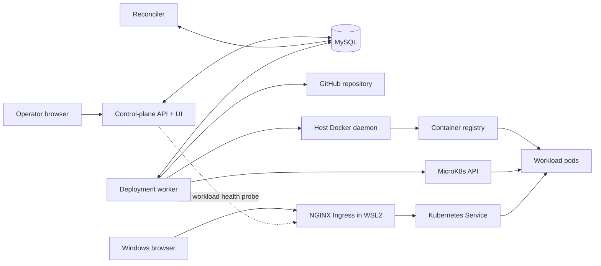
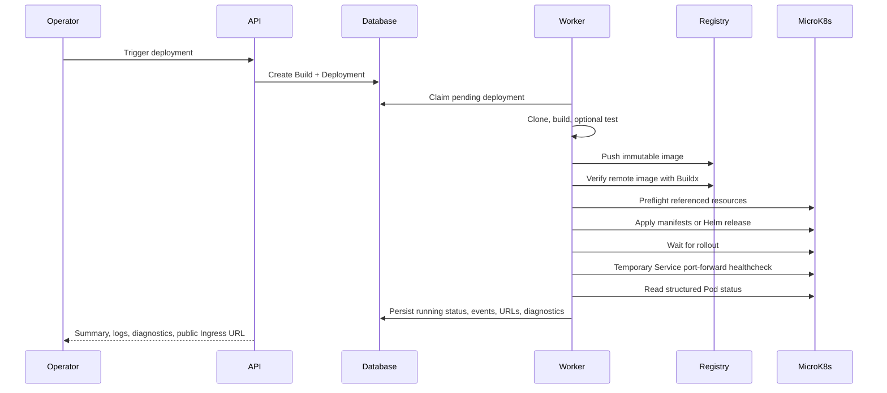

# Architecture

This repository implements a local, operator-facing PaaS control plane. It is designed as a realistic DevOps portfolio system, not as a public multi-tenant production PaaS.

Start with the [simplified architecture overview](../diagrams/autodeploy-architecture-overview.png) for the primary component and ownership boundaries. The [detailed architecture diagram](../diagrams/autodeploy-architecture.png) expands the same model with executor internals, build systems, runtime modes, and reconciliation targets.

## System Context

The API persists desired work and presents status. The worker owns deployment execution. The reconciler repairs stale control-plane state and removes leftover runtime resources.

The relational ownership graph is documented in the [Data model](data-model.md). The design rationale is captured in the [Architectural Decision Records](decisions/README.md), while concrete failure and recovery behavior is summarized in [Reliability and recovery](reliability.md).

Stop and cleanup operations follow the same ownership boundary: the API creates a pending `DeploymentCommand`, returns `202 Accepted`, and the worker claims and executes the command. This keeps Docker, Kubernetes, and Helm calls out of HTTP request handlers.

## Deployment Flow

Pending deployments are claimed atomically. Claims are renewed during long commands, and ownership is checked before important state writes. A lost claim stops processing without overwriting another worker's result.

Stop requests are also cooperative cancellation signals. A deployment worker checks for an active stop command at step boundaries and through executor heartbeats, then releases its deployment claim without recording an execution failure. Command workers do not claim stop work while the deployment still has a live claim; after the deployment worker acknowledges cancellation, the command worker owns runtime cleanup and the final transition to `stopped`. This prevents deployment and stop workers from applying conflicting runtime side effects concurrently.

Deployment execution reads a versioned project-spec snapshot stored with the deployment rather than the mutable Project row. Project edits therefore configure future deployments only. Retry preserves the original build's explicit test-command choice, including an explicit decision to disable tests.

Deployment and build status changes go through their model transition methods in the API application layer, worker, command processor, and reconciler. Invalid internal transitions fail instead of silently creating an impossible lifecycle combination. Cleanup is the explicit exception that permits a failed deployment to become stopped after its runtime resources are removed.

The reconciler creates one context per deployment, lazily constructs at most one executor, and reuses it across its ordered reconciliation actions. Each action still owns its transaction and event semantics, while the orchestration loop is declarative rather than a chain of repeated conditionals.

## Kubernetes Runtime

The Kubernetes executor supports two workload deployment modes:

- `manifest`: generates Deployment, ClusterIP Service, and optional Ingress resources directly.
- `helm`: maps the project/build model into the stack-agnostic `generic-web-app` chart.

Ingress configuration is platform-wide. Public hostnames use an alphabetic deployment ID so dotted `nip.io` IPs are not misparsed. Under WSL2, the public base domain must use the current WSL address because the Windows browser and Linux runtime have different loopback interfaces.

The worker healthcheck intentionally uses a temporary Service port-forward instead of the public Ingress. This separates application readiness from external DNS and controller routing. After deployment, the selected running workload has a separate live signal: the browser polls the control-plane API, which probes the recorded public URL plus the project healthcheck path and returns the real HTTP result.

Local Docker publication and Kubernetes port-forwarding retry a newly allocated local port only when the runtime reports a recognized bind collision. Other startup and healthcheck failures are not retried as port conflicts.

Stop or cleanup removes Deployment, Service, and Ingress resources; Helm workloads are uninstalled as a release. Cleanup preserves database, event, log, and audit history.

## Observability and Failure Recovery

Deployment events record step-level progress for clone, build, test, push, preflight, rollout, healthcheck, stop, and cleanup. Known secret values are redacted before metadata and logs are returned.

After a successful Kubernetes healthcheck, the worker captures a best-effort, 200-line snapshot from all workload containers into `runtime.log`. The same runtime-log API and console panel used by the local Docker executor expose this snapshot. It is a point-in-time capture, not a continuous log stream; Kubernetes diagnostics separately collect current and previous Pod logs when rollout or healthcheck failures occur.

While the selected deployment is active, the operator console polls its summary and persisted events every two seconds. The event stream therefore advances without a page refresh through `pending`, clone, build, optional test, push, and deploy stages. Polling stops when the deployment reaches `running`, `failed`, or `stopped`, and the console reloads final logs and diagnostics once at that boundary.

Application events are written as structured JSON to stdout. API completion records include request correlation, response status, and duration; worker and reconciler records use the same formatter. An optional, dedicated-token-protected `/metrics` endpoint exposes low-cardinality aggregates derived from persisted control-plane state. Metrics never use project, deployment, repository, branch, image, user, request, or error text as labels.

Prometheus, Grafana, Loki, tracing collectors, and dashboard provisioning are intentionally external integrations rather than bundled platform components. This keeps the local portfolio runtime small while retaining standard log and metrics interfaces.

Live workload health is transient and non-persistent. It does not change the deployment state machine: a Pod deletion can produce `healthy -> unhealthy -> healthy` while the Kubernetes Deployment recreates the Pod and the control-plane deployment remains `running`. Persisted failure transitions remain the responsibility of deployment execution and reconciliation, not a single health probe.

Kubernetes diagnostics include:

- Pod phase and names
- container reason and restart count
- workload images and imagePullSecrets
- current and previous container log summaries
- Deployment, Service, Ingress, and Helm metadata
- likely-cause hints for image pull and restart failures

The operator can copy or download a JSON bundle containing the selected deployment summary, structured diagnostics, events, and currently loaded build/runtime log tails.

The reconciler clears stale claims, detects missing Docker/Kubernetes/Helm resources, marks invalid running deployments failed, and performs best-effort cleanup of leftover resources.

## Security and Scope Boundaries

- Bearer tokens provide a small `read_only`, `deployer`, and `admin` role model.
- Git and registry credentials come from ignored local secret files or Kubernetes Secrets.
- Workload secret environment variables must use Kubernetes Secret references.
- The Docker socket and kubeconfig are deliberate local-demo trust boundaries; the base Helm chart keeps Docker socket mounting disabled unless a local override enables it explicitly.
- Namespace-per-tenant isolation, external identity, TLS automation, and hardened build isolation are outside the current scope.
