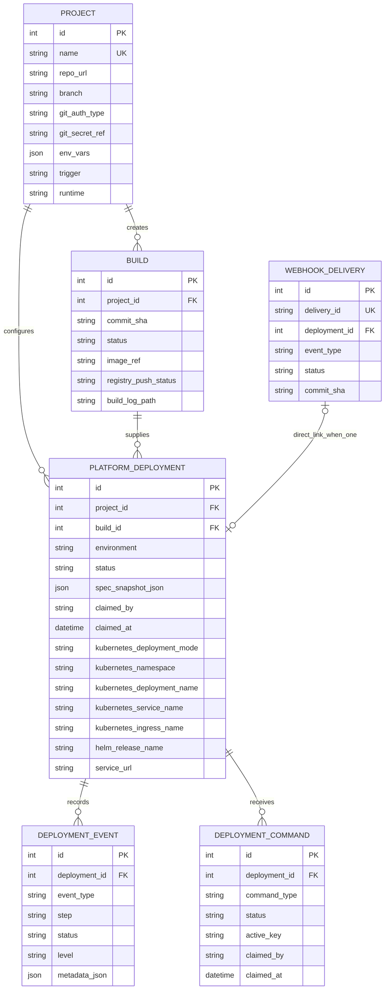
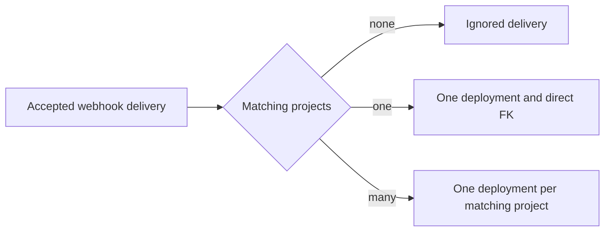

# Data Model

The relational model separates reusable project configuration, build artifacts, runtime attempts, operator commands, and evidence. This lets the control plane preserve what happened during an old deployment even after the project is edited or its runtime resources are removed.

## Entity Relationship Diagram

`AUDIT_EVENT` is intentionally outside the foreign-key graph. It records security and operator actions using `resource_type` and `resource_id` strings, so audit evidence is not coupled to the lifecycle of one domain table.

## Entity Responsibilities

| Entity | Responsibility | Important invariant |
| --- | --- | --- |
| `Project` | Stores the mutable specification used to request future work. | Editing a project must not rewrite an existing deployment. |
| `Build` | Tracks source identity, build/test progress, registry publication, and artifact logs. | Build state is distinct from runtime deployment state. |
| `PlatformDeployment` | Tracks one deployment attempt, its immutable specification snapshot, worker claim, and runtime identity. | State changes must follow the deployment transition graph. |
| `DeploymentEvent` | Stores the ordered diagnostic timeline for a deployment. | Events remain available after failure or runtime cleanup. |
| `DeploymentCommand` | Represents asynchronous stop and cleanup work. | Only one active command of the same type may exist for a deployment. |
| `WebhookDelivery` | Records GitHub delivery IDs and their processing result. | A delivery ID is unique, making webhook retries idempotent. A direct deployment FK is retained only when the delivery creates exactly one deployment. |
| `AuditEvent` | Records authenticated or security-relevant actions and request correlation. | Audit data is separate from the deployment event stream. |

## Mutable Specification and Immutable Attempts

`Project` is the current desired template. When the API accepts a deployment request, it resolves the source commit and stores a versioned copy of the relevant project fields in `PlatformDeployment.spec_snapshot_json`. The worker executes from that snapshot rather than rereading mutable project settings.

This boundary provides two useful properties:

- a queued deployment cannot silently change when the project is edited;
- old deployment records remain explainable because their repository, build, environment, resource, and authentication references are retained.

The snapshot contains only symbolic names for Git tokens and Kubernetes `secret_key_ref` values; those referenced credential values are not copied into the database. Literal environment values are different: when an `env_vars` item contains `is_secret: true` and a literal `value`, that plaintext value is stored in both `Project.env_vars` and every new deployment's `spec_snapshot_json`. Serialization and diagnostic redaction mask it from normal API surfaces but do not provide encryption at rest or protection from direct database/backup access. This is an accepted local/portfolio-stage risk, not a production secret-storage design.

Retry validates and copies the selected deployment's snapshot, reuses its build commit and effective test command, and records the source deployment in `deployment.created` metadata. It fails closed when a complete snapshot cannot be proven. Redeploy instead records a new snapshot from the current `Project` and resolves the latest deployment branch again. This distinction keeps historical reproduction explicit without adding mutable lineage columns to the deployment row.

`PlatformDeployment` itself is a mutable lifecycle record. Status, worker claim, runtime identity, service URL, commands, and events change over time. The immutable boundary is `spec_snapshot_json`, not every field on the deployment row.

Immediately before the first Kubernetes side effect, the worker persists the attempt's deployment mode and namespace in `kubernetes_deployment_mode` and `kubernetes_namespace`. Manifest mode also persists its exact Deployment, Service, and Ingress names. Stop, status inspection, and reconciliation use those values rather than the platform's current Kubernetes configuration or naming rules. Helm release name, namespace, and chart path remain additional Helm-specific identity. Migrations recover legacy identity from persisted Helm, preflight, and event metadata where available; legacy Kubernetes rows without Helm metadata are treated as manifest-managed, and their resource names are recovered from events or reconstructed with the historical naming rule.

## Webhook Fan-out

One accepted GitHub delivery is matched against every eligible project. It can therefore create zero, one, or many deployments. `WebhookDelivery.deployment_id` is a convenience link populated only when exactly one deployment results; it does not model or limit the fan-out.

## Build and Deployment Separation

A build answers: “Which source was tested and which image was produced?” A deployment answers: “What happened when that artifact was applied to a runtime?” Keeping both records makes build, registry, and runtime stages independently inspectable. The current failure policy may still mark the associated build failed when the overall execution cannot produce a usable deployment, while the earlier successful step events remain in the timeline.

The schema permits a build to be associated with more than one deployment record. This supports workflows that reuse an artifact without collapsing separate runtime attempts into one history entry.

## Evidence and Commands

`DeploymentEvent` is the deployment-specific timeline. It contains step names, statuses, human-readable summaries, and structured metadata used by the UI diagnostics views.

`DeploymentCommand` keeps stop and cleanup outside API request handlers. Its nullable `active_key` participates in a unique constraint with deployment and command type. While the value is `active`, a repeated request reuses the existing command; terminal `succeeded`, `failed`, or `skipped` processing clears the key so a later command can be recorded without deleting history. A Helm command is `skipped` when a newer deployment owns the shared project/environment release.

`AuditEvent` answers a different question from `DeploymentEvent`: who requested or accessed an operation, under which role and request ID. The two histories are complementary rather than duplicates.

## Deletion and Retention

Removing runtime resources does not delete the project, build, deployment, event, command, or audit records. Project deletion is a separate administrative action; its owned build, deployment, event, and command relationships are modeled with ORM cascades. It does not queue stop or cleanup work before deleting those records, so an administrator must stop or clean a runtime workload explicitly before deleting its project. Operational retention policies are documented in the [Runbook](runbook.md); runtime cleanup semantics are documented in the [Deployment model](deployment.md).

## Related Decisions

- [Database-backed asynchronous work](decisions/0001-database-backed-asynchronous-work.md)
- [Immutable deployment specification snapshots](decisions/0002-immutable-deployment-snapshots.md)
- [Stable Helm release identity](decisions/0004-stable-helm-release-identity.md)
