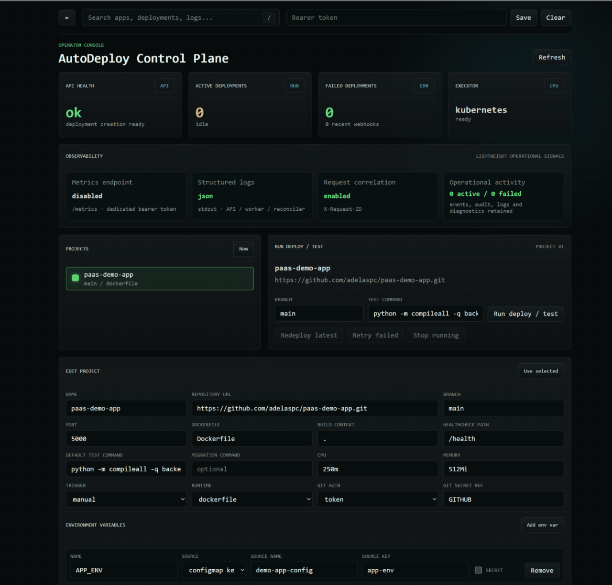

# AutoDeploy Demo

This walkthrough demonstrates AutoDeploy as an operator-facing control plane rather than presenting the sample application as the product. Each scenario changes one deliberate input and follows the resulting build, deployment, health, event, and diagnostic evidence through the platform.

The reference workload is [Deployment Lab](https://github.com/adelaspc/paas-demo-app). It is a small, stateless Flask and Vue application designed to expose which release and configuration are actually running without reproducing control-plane state inside the workload.

## What the demo proves

- Project configuration is declarative and separated from control-plane configuration.
- HTTP requests persist desired work while a leased worker owns build and deployment side effects.
- Images are built, tested, uniquely tagged per build, pushed, and verified by their reported digest before registry-backed rollout.
- Kubernetes resources are installed through Helm and observed through rollout, health, logs, and diagnostics.
- ConfigMap and Secret references reach the workload without storing secret values in the project specification.
- Deployment history remains immutable across configuration changes, failures, recovery, and cleanup.

## Demo environment

The recording uses the `local-kubernetes` profile with the control plane and MySQL running in Docker Compose. The worker builds through the trusted local Docker socket, publishes to Docker Hub, and deploys the workload into a local MicroK8s namespace through Helm.

| Setting | Demo value | Why it is used |
| --- | --- | --- |
| Executor | `kubernetes` | Exercises the real Kubernetes deployment path. |
| Deployment mode | `helm` | Demonstrates release metadata, upgrade behavior, diagnostics, and cleanup. |
| Namespace | `default` | Keeps the local single-node demo easy to inspect. |
| Registry | `docker.io/adelicious` | Publishes an image that MicroK8s can pull. |
| Ingress | enabled with a local `nip.io` domain | Gives each deployment a browser-accessible service URL. |
| Image pull Secret | `dockerhub-pull` | Keeps registry credentials outside project data. |

Credentials remain in ignored local configuration or Kubernetes Secrets. No token, password, kubeconfig content, or Secret value should appear in a recording or in this document.

The console presents the selected project's recent activity and deployment history. API filters, cursors, and cross-project search are not exposed in this UI; do not present the top bar as a working search control in a recording.

## Project configuration

| Project field | Value | Purpose |
| --- | --- | --- |
| Name | `paas-demo-app` | Produces recognizable image and Helm release names. |
| Repository | `https://github.com/adelaspc/paas-demo-app.git` | Provides the Dockerfile-based reference workload. |
| Branch | `main` | Uses the published demo branch. |
| Git authentication | token reference `GITHUB` | Demonstrates symbolic Git credentials without persisting the token. |
| Dockerfile / build context | `Dockerfile` / `.` | Builds the repository root with its multi-stage image. |
| Port | `5000` | Matches the Gunicorn HTTP listener. |
| Healthcheck | `/health` | Exposes healthy, starting, and controlled failure states. |
| Test command | `python -m compileall -q backend` | Runs a deterministic validation inside the built runtime image. |
| CPU / memory | `250m` / `512Mi` | Demonstrates Kubernetes resource configuration. |
| Trigger | `manual` | Keeps timing under the operator's control during recording. |

The migration command is intentionally empty. It is reserved by the v1 application specification and is not executed for user workloads.

### Runtime environment

| Variable | Source | Initial value or reference | What it demonstrates |
| --- | --- | --- | --- |
| `APP_ENV` | ConfigMap key | `demo-app-config` / `app-env` | Kubernetes-native non-secret configuration. |
| `APP_VERSION` | platform-injected | unique build image tag | Visible release identity for the workload. |
| `APP_COMMIT_SHA` | platform-injected | exact build commit SHA | Comparison between source identity and the running workload. |
| `FEATURE_MESSAGE` | literal | `Running through the local PaaS` | A visible configuration update. |
| `DEMO_SECRET` | Secret key | `demo-app-secret` / `demo-secret` | Secret presence without returning its value. |
| `DEMO_STARTUP_DELAY_SECONDS` | literal | `0` | Controlled readiness delay. |
| `DEMO_FAIL_STARTUP` | literal | `false` | Controlled CrashLoopBackOff scenario. |
| `DEMO_HEALTH_STATUS` | literal | `healthy` | Controlled healthcheck behavior. |
| `DEMO_RESPONSE_DELAY_MS` | literal | `0` | Optional application API latency. |

## 01 — Happy-path deployment

[](assets/demo/01-happy-path.mp4)

**[Watch with playback controls (MP4, 5.0 MB)](assets/demo/01-happy-path.mp4)**

**Goal:** Show the complete asynchronous path from project configuration to a healthy workload.

**Action:** Create the project with the baseline configuration and select **Run deploy / test**.

**What to watch:** Source resolution, clone, image build, containerized test, registry push and verification, Kubernetes preflight, Helm rollout, healthcheck, Pod diagnostics, and the final `running` state.

**Result:** Open the service and compare its version, commit, environment, Pod hostname, secret-mounted state, and health posture with the persisted deployment summary.

## 02 — Configuration update and redeploy

**[Watch the configuration update and redeployment (MP4, 3.7 MB)](assets/demo/02-configuration-update.mp4)**

**Goal:** Demonstrate declarative configuration changes and retained deployment history with immutable input snapshots.

**Change:** Update `FEATURE_MESSAGE`, then save and redeploy. The platform gives the new workload its own `APP_VERSION` build tag and its resolved `APP_COMMIT_SHA`.

**What to watch:** A new deployment and image are created; the workload reports the updated values while the previous deployment remains available in history.

**Reset:** Keep the new healthy version or restore the baseline values before another scenario.

## 03 — Readiness failure and recovery in Helm mode

**[Watch the healthcheck failure and recovery (MP4, 10.2 MB)](assets/demo/03-healthcheck-failure.mp4)**

**Goal:** Demonstrate persisted failure evidence and recovery through a new deployment.

**Change:** Set `DEMO_HEALTH_STATUS=failed` and deploy. Helm waits for workload readiness and can time out before AutoDeploy reaches its separate HTTP probe through Service port-forward. Inspect events and diagnostics, then restore `healthy` and redeploy.

**What to watch:** The failed deployment remains in history with its reason and diagnostics; recovery creates a separate healthy deployment instead of rewriting the failure.

## 04 — CrashLoopBackOff diagnostics

**[Watch the CrashLoopBackOff diagnostics (MP4, 4.8 MB)](assets/demo/04-crashloopbackoff.mp4)**

**Recording status:** This clip predates the Helm failure snapshot remediation and primarily shows the generic Helm timeout. It does not demonstrate all diagnostic fields now supported. A replacement should show the persisted snapshot status/time, container state, restart count, current or previous logs, and recovery as a new deployment.

**Goal:** Show actionable container failure diagnostics.

**Change:** Set `DEMO_FAIL_STARTUP=true` and deploy.

**What to record in the replacement clip:** The original Helm failure, snapshot capture status/time, container state and restart count, available current/previous Pod logs, and evidence-based likely-cause guidance. Explain any unavailable evidence rather than implying that every failure has previous logs.

**Reset:** Restore `DEMO_FAIL_STARTUP=false` and redeploy before continuing.

## 05 — Kubernetes self-healing

**[Watch Kubernetes replace a deleted Pod (MP4, 1.5 MB)](assets/demo/05-k8s-self-healing.mp4)**

**Goal:** Separate transient live health from persisted deployment lifecycle state.

**Action:** Copy the exact Pod name from diagnostics and delete only that Pod.

**What to watch:** Diagnostics remain the persisted snapshot of the selected deployment; refreshing them does not inspect the replacement Pod. The control-plane API's live health may briefly become unhealthy, the Deployment remains `running`, Kubernetes creates a replacement Pod, and API live health recovers with a new hostname. Use **Open service in browser** to verify browser access, and the workload hostname or scoped `kubectl get pods` to verify the replacement.

## 06 — Diagnostics and cleanup

**[Watch the Kubernetes resource cleanup (MP4, 5.0 MB)](assets/demo/06-cleanup.mp4)**

**Goal:** Close the lifecycle while retaining operator evidence.

**Action:** Review the event timeline, image identity, build and runtime log tails, structured Pod fields, and diagnostics bundle. Then select **Cleanup Kubernetes resources**.

**What to watch:** Helm resources are removed while project, deployment, event, audit, and diagnostic history remain available in the control plane.

## Healthy baseline

Return to these values before the main recording and after every controlled-failure take:

```text
FEATURE_MESSAGE=Running through the local PaaS
DEMO_STARTUP_DELAY_SECONDS=0
DEMO_FAIL_STARTUP=false
DEMO_HEALTH_STATUS=healthy
DEMO_RESPONSE_DELAY_MS=0
```

For the recording order, narration, safety checks, and exact cleanup procedure, see the [recording script](demo-script.md). For environment setup and operational troubleshooting, see the [runbook](runbook.md).

## Adding media

Store small repository-hosted assets under `docs/assets/demo/`. The happy-path scenario uses `01-happy-path.gif` as its inline preview and links it to `01-happy-path.mp4` for playback controls. Prefer short, tightly cropped GIF or animated WebP previews for additional scenarios, and link longer MP4 recordings rather than embedding them to avoid slowing down the page.

To add an inline preview that opens the full recording, use Markdown such as:

```markdown
[](assets/demo/01-happy-path.mp4)
```

Every clip should remain understandable without audio. Keep the surrounding goal, change, result, and reset text as the accessible fallback and narrative context.
